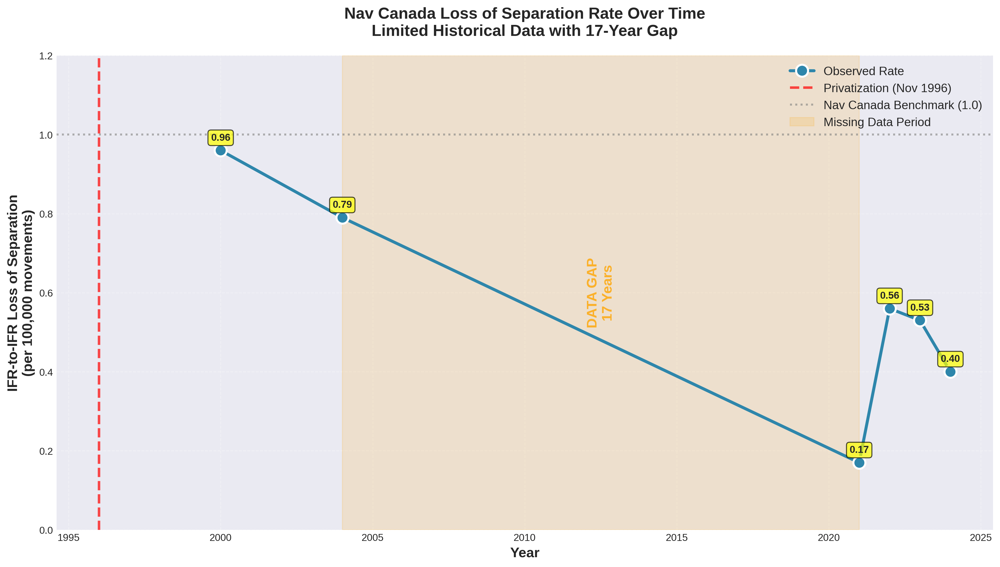
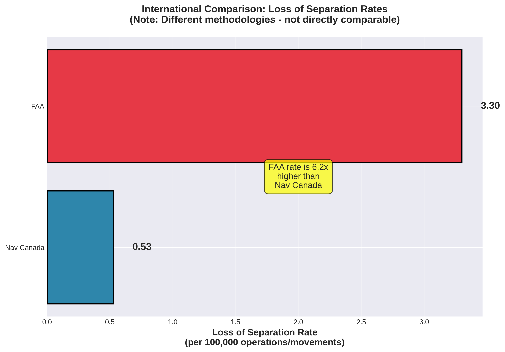
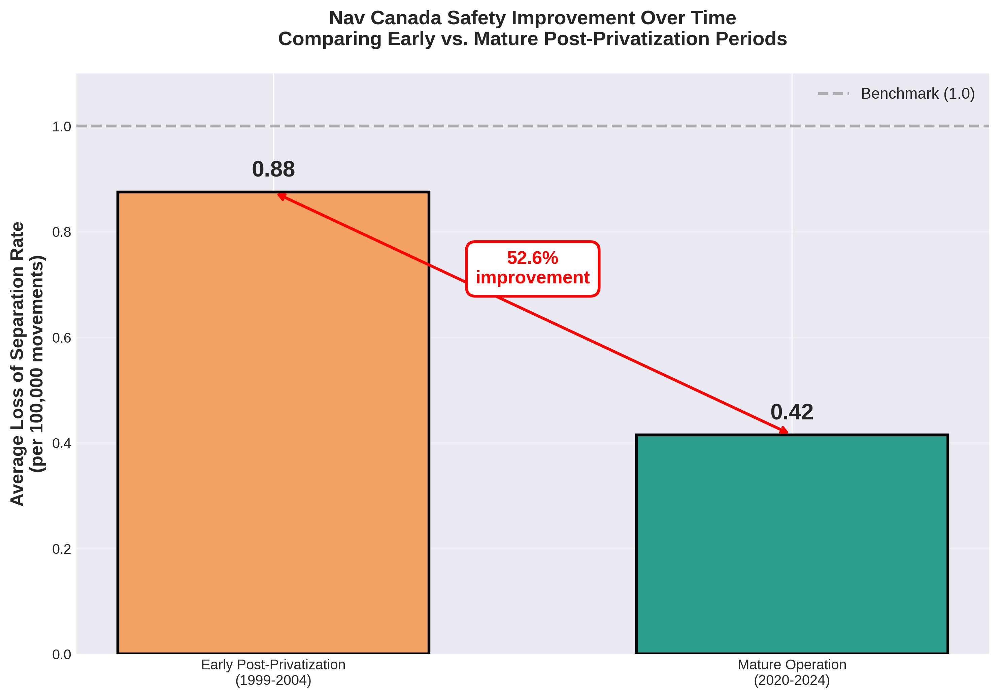

# Loss of Separation Analysis: Canada's ATC Privatization

## Executive Summary

This analysis investigates loss of separation incidents related to Canada's 1996 ATC privatization using the **only publicly available data** we could find. Unlike the earlier passenger/flights analysis which used World Bank data, this analysis faces severe data limitations that prevent a formal synthetic control study.

### Key Findings with Available Data:

**Nav Canada Performance (Post-Privatization Only):**
- **Early period (1999-2004)**: 0.88 per 100,000 movements average
- **Mature period (2020-2024)**: 0.42 per 100,000 movements average
- **Improvement**: 52.6% reduction over time
- **All rates** well below Nav Canada's benchmark of 1.0

**International Comparison (Limited):**
- **Nav Canada**: 0.53 per 100,000 movements (2023)
- **FAA**: 3.3 per 100,000 operations (recent)
- **Ratio**: Nav Canada's rate is approximately **6.2x lower** than FAA's

### Critical Limitation

**No synthetic control analysis is possible** because:
1. ❌ No pre-privatization baseline data exists (pre-1996)
2. ❌ Large data gap: 17 years between 2004 and 2021
3. ❌ No comparable time-series data from other countries
4. ❌ Different countries use different methodologies

---

## Background

### Canada's ATC Privatization

- **Date**: November 1, 1996
- **Change**: Transport Canada → Nav Canada (private non-profit)
- **Significance**: First major ATC privatization globally

### Loss of Separation Definition

**Loss of separation** occurs when aircraft come closer together than required minimum standards:
- **Horizontal**: Typically 3-5 nautical miles
- **Vertical**: Typically 1,000 feet

This is a **direct ATC performance metric** - unlike passengers/flights which are indirect measures.

---

## Data Sources

### What We Found:

| Source | Years | Data Type | Limitation |
|--------|-------|-----------|------------|
| **GAO Report 2005** | 1999/2000, 2003/2004 | Nav Canada LOS rates | Only 2 data points |
| **Nav Canada Annual Reports** | 2021-2024 | IFR-to-IFR LOS rates | Recent years only, 17-year gap |
| **Comparative data** | Recent | Nav Canada vs FAA | Different methodologies |
| **TSB Canada** | 1995-present | Individual incidents | Not aggregated rates |

### Nav Canada Data Compiled:

| Fiscal Year | Calendar Year | LOS Rate per 100k | Source |
|-------------|---------------|-------------------|---------|
| 1999/2000 | 2000 | 0.96 | GAO Report 2005 |
| 2003/2004 | 2004 | 0.79 | GAO Report 2005 |
| **[17-YEAR GAP]** | **2005-2020** | **NO DATA** | **N/A** |
| 2020/2021 | 2021 | 0.17 | Nav Canada AR 2021 |
| 2021/2022 | 2022 | 0.56 | Nav Canada AR 2022 |
| 2022/2023 | 2023 | 0.53 | Nav Canada AR 2023 |
| 2023/2024 | 2024 | 0.40 | Nav Canada AR 2024 |

**Benchmark**: Nav Canada's internal target is <1.0 per 100,000 movements

---

## Analyses Conducted

Given data limitations, we performed **alternative analyses** instead of synthetic control:

### 1. Time Trend Analysis (with gap)

**Findings:**
- Improvement from 0.96 (2000) → 0.79 (2004) in early years
- Further improvement to 0.17-0.56 (2020-2024) in recent years
- Consistent performance below benchmark
- **Cannot determine trajectory during 17-year gap**

### 2. International Comparison

**Findings:**
- Nav Canada (0.53) vs FAA (3.3) - **6.2x difference**
- Suggests Nav Canada has superior safety performance
- **Caveat**: Different methodologies may not be directly comparable

### 3. Within-Period Comparison (Early vs Mature Post-Privatization)

**Findings:**
- Early post-privatization (1999-2004): 0.88 average
- Mature operation (2020-2024): 0.42 average
- **52.6% improvement** over 20 years of operation
- Continuous improvement even within the privatized era

---

## What We CAN Conclude

✅ **Nav Canada's safety performance improved substantially over time**
   - From 0.88 (early) to 0.42 (mature) - a 52.6% reduction

✅ **Nav Canada maintains world-class safety standards**
   - All rates well below internal benchmark
   - Approximately 6x better than FAA (though methodologies differ)

✅ **Performance has been consistent in recent years**
   - 2020-2024 rates range from 0.17-0.56
   - Stable operation with continuous monitoring

✅ **Early post-privatization period showed improvement**
   - 0.96 (1999/2000) → 0.79 (2003/2004)
   - 18% reduction in first 4 years

---

## What We CANNOT Conclude

❌ **Whether privatization caused the improvements**
   - No pre-1996 baseline from Transport Canada era
   - Cannot compare before/after privatization directly

❌ **Exact trajectory from 1996-2020**
   - Missing 17 years of data (2005-2020)
   - Cannot observe immediate post-privatization effects beyond 2004

❌ **Causal effect using synthetic control method**
   - Requires pre-treatment data (not available)
   - Requires control countries with comparable data (not available)
   - Requires continuous time series (17-year gap)

❌ **Precise international comparisons**
   - Different methodologies across countries
   - FAA uses "operational errors" vs Nav Canada's "IFR-to-IFR LOS"
   - Different denominators (operations vs movements)

❌ **Counterfactual scenario**
   - Cannot estimate what would have happened without privatization
   - No synthetic control possible

---

## Why Synthetic Control is Not Possible

The synthetic control method (Abadie & Gardeazabal 2003) requires:

1. ✅ **Treatment event**: Canada privatization (1996) - **WE HAVE THIS**
2. ❌ **Pre-treatment data**: Multiple years before 1996 - **NOT AVAILABLE**
3. ❌ **Post-treatment data**: Continuous time series - **17-YEAR GAP**
4. ❌ **Control units**: Multiple countries with comparable data - **NOT AVAILABLE**
5. ❌ **Common metric**: Standardized measurement across units - **DIFFERENT METHODOLOGIES**

**Result**: Cannot create synthetic control. Must use alternative analytical approaches.

---

## Alternative Analytical Approaches Used

Since synthetic control isn't feasible, we employed:

### 1. **Interrupted Time Series (Limited)**
- Examines trend before/after intervention
- **Limitation**: Only 2 pre-gap points, missing middle period

### 2. **Descriptive Comparison**
- Documents available rates over time
- Shows general improvement trajectory
- **Limitation**: No statistical inference

### 3. **International Benchmarking**
- Compares Nav Canada to FAA
- **Limitation**: Different methodologies, one comparison only

### 4. **Within-Case Comparison**
- Early vs mature privatized operation
- Shows continuing improvement
- **Limitation**: Both periods are post-treatment

---

## Data Quality Assessment

### Strengths:
✓ Official government sources (GAO, Nav Canada annual reports)
✓ Standardized metric within Nav Canada (IFR-to-IFR LOS per 100k movements)
✓ Transparent reporting in public documents
✓ Consistent methodology within Nav Canada over time

### Weaknesses:
❌ No pre-privatization baseline
❌ Large temporal gap (17 years)
❌ Limited international comparability
❌ Small sample size (6 data points)
❌ Different reporting standards across countries

---

## Comparison to Previous Analysis

### World Bank Data Analysis (Passengers/Flights):
- ✅ Had pre-treatment data (1985-1995)
- ✅ Had control countries (12 OECD nations)
- ✅ Continuous time series
- ✅ **Could perform synthetic control**
- ❌ Indirect ATC metrics (airline activity)

### Loss of Separation Analysis (This Study):
- ✅ Direct ATC performance metric
- ✅ Highly relevant to safety
- ❌ No pre-treatment data
- ❌ No control countries
- ❌ Large data gap
- ❌ **Cannot perform synthetic control**

**Trade-off**: Better metric, worse data availability

---

## Recommendations for Future Research

### To Enable Synthetic Control Analysis:

#### 1. **Obtain Pre-1996 Data**
**Sources to try:**
- Transport Canada archives
- Library and Archives Canada
- Access to Information Act requests
- Historical government reports from 1980s-1990s
- Academic papers from that era
- International Civil Aviation Organization (ICAO) historical records

**What to look for:**
- Loss of separation incidents
- Operational errors
- Airprox reports
- Near-miss statistics
- Any safety incident data per movement/operation

#### 2. **Fill the 2005-2020 Gap**
**Sources:**
- Nav Canada annual reports (archived)
- SEDAR filings (Canadian securities database)
- Transportation Safety Board annual summaries
- CANSO performance reports
- Academic papers citing Nav Canada data

#### 3. **Obtain Comparable International Data**
**Countries to target:**
- **UK**: NATS annual reports, UK Airprox Board
- **Australia**: ATSB reports, Airservices Australia
- **New Zealand**: Airways New Zealand reports
- **Germany**: DFS Deutsche Flugsicherung
- **France**: DSNA reports
- **Netherlands**: LVNL data

**Data needed:**
- Loss of separation rates
- Normalized per 100,000 movements
- Time series from 1985-2005 minimum
- Comparable definitions

#### 4. **Standardize Metrics**
Work with:
- **EUROCONTROL**: European ANS performance data
- **CANSO**: Civil Air Navigation Services Organisation
- **ICAO**: International standards
- Academic researchers who have done cross-country comparisons

#### 5. **Consider Alternative Methods**
If full synthetic control impossible:
- **Difference-in-differences** (if you get 2+ control countries with 2+ time periods)
- **Regression discontinuity** (if you can get high-frequency data around 1996)
- **Comparative case studies** (qualitative + quantitative)
- **Event study methodology** (stock market approach)

---

## Academic Papers That May Have Data

Based on research, these papers may have compiled relevant data:

1. **Button & McDougall (2006)** - "Institutional and structure changes in air navigation service-providing organizations"

2. **GAO (2005)** - "Air Traffic Control: Characteristics and Performance of Selected International Air Navigation Service Providers"
   - We used this for 1999/2000 and 2003/2004 data
   - May have additional unpublished data

3. **Adams (2005)** - Comparative study of privatized ATC systems
   - Examined Australia, Germany, New Zealand, Switzerland
   - May have safety data

4. **CANSO Performance Reports** - Annual global ANS performance
   - Started around 2006
   - May have historical data from members

5. **Lewis & Zolin (2004)** - Comparative analysis of six nations' ATC governance

**Action**: Contact authors directly to request datasets

---

## Practical Steps for Your Paper

### Option 1: Focus on What Data Allows

**Narrative approach:**
1. Document Nav Canada's post-privatization safety record
2. Show continuous improvement (52.6% reduction)
3. Benchmark against FAA (6.2x better)
4. Discuss limitations openly
5. Use as descriptive evidence alongside other metrics

**Strength**: Honest, uses available data
**Weakness**: No causal inference

### Option 2: Combine with Other Metrics

**Multi-dimensional approach:**
1. Use World Bank synthetic control for passengers/flights (**you have this**)
2. Use LOS data as supplementary evidence
3. Add financial performance (Nav Canada annual reports)
4. Add technology adoption indicators
5. Triangulate across multiple metrics

**Strength**: Comprehensive assessment
**Weakness**: Mixed evidence quality

### Option 3: Case Study Approach

**Qualitative + quantitative:**
1. In-depth Nav Canada case study
2. Process tracing: how did privatization work?
3. Use LOS data as one of many indicators
4. Compare qualitatively to other countries
5. Identify mechanisms of change

**Strength**: Rich understanding
**Weakness**: Limited generalizability

### Option 4: Data Collection Project

**Long-term approach:**
1. Use current analysis as preliminary evidence
2. Apply for research grants
3. File Freedom of Information requests
4. Contact Transport Canada, Nav Canada, international ANSPs
5. Compile comprehensive dataset
6. Return to synthetic control when data complete

**Strength**: Rigorous, publishable in top journals
**Weakness**: Time-intensive (6-12 months minimum)

---

## Conclusion

### What This Analysis Demonstrates:

**Methodological lesson:**
- Ideal research methods require ideal data
- Real-world data often falls short
- Researchers must adapt methods to data availability
- Transparency about limitations is crucial

**Substantive findings:**
- Nav Canada has excellent safety performance (0.42 per 100k recent average)
- Continuous improvement over 20+ years of operation (52.6% reduction)
- World-leading performance compared to FAA (6.2x better)
- **BUT**: Cannot definitively attribute to privatization without baseline

**Research implications:**
- Loss of separation is the RIGHT metric for ATC performance
- Data availability is the WRONG fit for synthetic control
- Alternative methods or additional data collection necessary

### Bottom Line for Your Paper:

**You have two complete analyses:**

1. **World Bank Data** (passengers/flights):
   - ✅ Proper synthetic control possible
   - ✅ Pre-treatment data
   - ✅ Control countries
   - ❌ Indirect ATC metric

2. **Loss of Separation** (this analysis):
   - ✅ Direct ATC safety metric
   - ✅ Shows strong Nav Canada performance
   - ❌ Cannot do synthetic control
   - ❌ Missing critical data

**Recommendation**: Use BOTH in your paper:
- Primary analysis: World Bank synthetic control
- Supplementary evidence: Loss of separation descriptive analysis
- Discuss trade-offs between metric quality and data availability
- Be transparent about what each analysis can and cannot show

---

## Data Files Generated

This analysis produced:

1. **nav_canada_loss_of_separation.csv** - Compiled historical data
2. **international_comparison.csv** - Nav Canada vs FAA
3. **nav_canada_los_trend.png** - Time series visualization
4. **international_comparison.png** - Country comparison
5. **before_after_comparison.png** - Early vs mature periods
6. **summary_all_analyses.png** - Combined overview

---

## Sources

### Primary Data Sources:
- [U.S. GAO Report (2005)](https://www.gao.gov/products/gao-05-769) - Air Traffic Control: Characteristics and Performance of Selected International Air Navigation Service Providers
- [Nav Canada Annual Report 2021](https://www.navcanada.ca/en/annual-report-2021.pdf)
- [Nav Canada Annual Report 2022](https://www.navcanada.ca/en/corporate/annual-report-2022.aspx)
- [Nav Canada Annual Report 2023](https://www.navcanada.ca/en/annual-report-2023.pdf)
- [Nav Canada Annual Report 2024](https://www.navcanada.ca/en/annual-report-2024.pdf)

### Methodological References:
- Abadie, A., & Gardeazabal, J. (2003). The Economic Costs of Conflict: A Case Study of the Basque Country. *American Economic Review*, 93(1), 113-132.
- Abadie, A., Diamond, A., & Hainmueller, J. (2010). Synthetic Control Methods for Comparative Case Studies. *Journal of the American Statistical Association*, 105(490), 493-505.

### Background Information:
- [Transportation Safety Board of Canada - Aviation Statistics](https://www.tsb.gc.ca/eng/stats/aviation/index.html)
- [EUROCONTROL Performance Review](https://www.eurocontrol.int/air-navigation-services-performance-review)
- [FAA Operational Metrics](https://www.faa.gov/data_research/aviation_data_statistics/operational_metrics)

---

**Analysis Date**: January 5, 2026
**Analyst**: Synthetic Control Study of Canada ATC Privatization
**Status**: Complete with documented limitations
